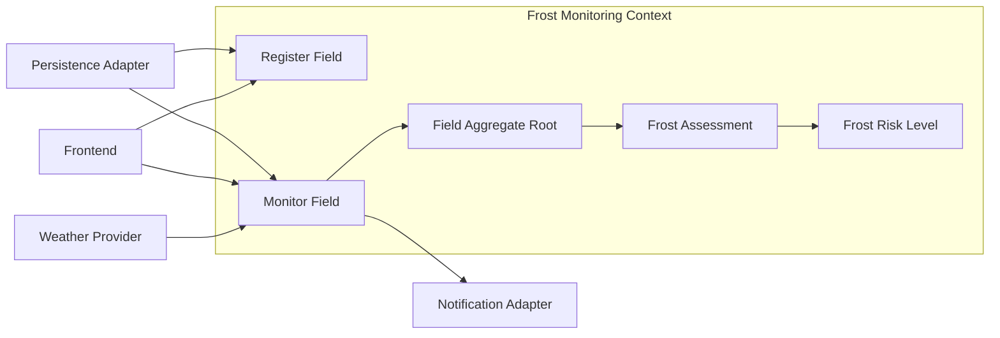

# ❄️ AgroFrost DDD — Clean Architecture for Frost Monitoring

[](https://github.com/Felipe713/agrofrost-ddd/actions/workflows/ci.yml)

> Educational Java project for the Java Bootcamp. It demonstrates Domain-Driven Design and Clean Architecture with pure Java; it is not a production frost-alert service.

## About the Project

AgroFrost registers agricultural fields and evaluates frost risk from a current measured temperature. Java 17, Maven, JUnit 5, Mockito and JaCoCo are used without Spring Boot, JPA, Hibernate, Jackson or Lombok.

## Evolution from Hito 1

This project evolves conceptually from [AgroFrost Core](https://github.com/Felipe713/agrofrost-core). Hito 1 remains in its own repository as historical evidence of the original TDD design. There is no Maven or runtime dependency between repositories.

## Clean Architecture and DDD goals

The core is framework-free. Domain holds business meaning and rules, Application coordinates use cases, and Infrastructure supplies replaceable details. The Frost Monitoring Bounded Context includes fields, temperatures, assessments, registration, monitoring and conceptual critical alerts. Weather APIs, databases, real messaging, sensors and web UI are outside this boundary.

The ubiquitous language uses `Field`, `FieldId`, `Crop`, `CriticalTemperature`, `MeasuredTemperature`, `FrostAssessment` and `FrostRiskLevel`. See the [Spanish glossary](docs/UBIQUITOUS_LANGUAGE_ES.md).

## Domain model

`Field` is the Aggregate Root and Entity, identified only by `FieldId`. It owns the `assessFrost` behavior. Value Objects are immutable Java records:

| Value Object | Purpose |
| --- | --- |
| FieldId / FieldName | Stable identity and readable field name |
| Crop | Open-ended crop name |
| CriticalTemperature | Validated threshold from -10 to 10 °C |
| MeasuredTemperature | Validated observation from -50 to 60 °C |
| FrostAssessment | Immutable evaluation result |

## 🧩 Entity vs Value Object

| Concept | Identity | Equality | Example |
| --- | --- | --- | --- |
| Entity | Has stable identity | Compared by identity | Field |
| Value Object | No independent identity | Compared by value | CriticalTemperature |

`Field` equality is based only on `FieldId`: two instances with the same identifier represent the same domain Entity. Value Object records use structural equality based on their values.

## Frost-risk rules

`Field.assessFrost` preserves the rules from Hito 1. The critical threshold and the upper warning threshold are inclusive.

| Measured temperature | Result |
| -------------------: | -------- |
| -1.0 °C | CRITICAL |
| 0.0 °C | CRITICAL |
| 1.5 °C | WARNING |
| 2.0 °C | WARNING |
| 2.1 °C | SAFE |

The table uses a critical temperature of 0 °C and a 2.0 °C warning margin.

## Architecture

```text
┌──────────────────────────────────────────────┐
│ Application                                  │
│ RegisterFieldUseCase · MonitorFieldUseCase   │
│ TemperatureProvider · FrostAlertNotifier     │
└───────────────────────┬──────────────────────┘
                        │ depends on
                        ▼
┌──────────────────────────────────────────────┐
│ Domain                                       │
│ Field (Entity / Aggregate Root)              │
│ Value Objects · FrostRiskLevel               │
│ FieldRepository · Domain Exceptions          │
└───────────────────────▲──────────────────────┘
                        │ implements FieldRepository
┌───────────────────────┴──────────────────────┐
│ Infrastructure                               │
│ InMemoryFieldRepository                      │
└──────────────────────────────────────────────┘
```

Application depends on Domain models and contracts. `InMemoryFieldRepository` depends on and implements the `FieldRepository` contract declared in Domain. Domain depends on neither Application nor Infrastructure.

## 🗺️ Frost Monitoring Context Map



This map is conceptual. `InMemoryFieldRepository` is the only concrete adapter currently implemented; weather, notifications, and frontend remain abstract or future integrations. The Bounded Context remains independent of those technologies.

## Package structure

```text
domain/{entity,valueobject,model,exception,repository}
application/{port,usecase}
infrastructure/persistence
```

`FieldRepository` is a technology-neutral domain contract. `InMemoryFieldRepository` is its in-memory infrastructure implementation. The use cases are `RegisterFieldUseCase` and `MonitorFieldUseCase`.

## Testing strategy

Tests validate Value Objects, exact risk boundaries, use-case collaboration with Mockito, repository behavior and dependency-direction rules. JaCoCo enforces 100% line and branch coverage for domain and application packages.

## Installation and commands

Requires JDK 17 and Maven.

```bash
mvn clean compile
mvn test
mvn clean verify
mvn clean test jacoco:report
```

Open `target/site/jacoco/index.html` for the JaCoCo report.

## Current limitations

There are intentionally no real weather provider, database, email/SMS/Telegram adapter, REST controller or frontend integration. These can be added as infrastructure adapters later.

## Related projects

- [AgroFrost Core](https://github.com/Felipe713/agrofrost-core) — Hito 1, TDD origin.
- [AgroFrost Frontend](https://github.com/Felipe713/agrofrost-frontend) — not yet integrated with this backend.

For a Spanish defense guide, see [Hito 3 explanation](docs/HITO3_EXPLANATION_ES.md).
